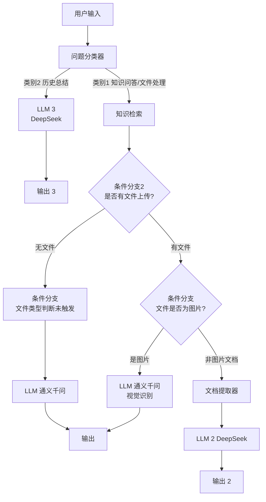

# AI机器人 Dify 工作流功能总结

## 一、工作流概述

该工作流是一个部署在 Dify 平台上的智能对话机器人，集成了**知识库问答**、**多模态内容处理**和**历史聊天记录总结**三大核心能力。工作流通过**问题分类器**对用户输入进行智能路由，根据不同的查询意图调用相应的处理逻辑，最终返回符合规范格式的回答。

### 核心特性

| 特性       | 说明                                                         |
| ---------- | ------------------------------------------------------------ |
| 部署平台   | Dify                                                         |
| 工作流模式 | workflow                                                     |
| 模型支持   | 通义千问（Qwen/Qwen3.6-35B-A3B）、DeepSeek（deepseek-v4-flash） |
| 知识库     | 已关联一个知识库                                             |
| 多模态支持 | 支持图片、文档文件上传与内容提取                             |

---

## 二、已实现的核心功能

### 1. 摘要总结 —— 历史聊天记录总结

**功能描述**：帮助用户快速了解历史对话内容，避免新入群用户爬楼查看历史消息。

**触发条件**：
- 用户输入被问题分类器归类为“**与总结历史聊天记录相关**”

**处理流程**：
- 用户输入 → 问题分类器（识别为类别2）→ LLM 3（DeepSeek）→ 输出 3

**实现节点**：
- 问题分类器
- LLM 3（DeepSeek）
- 输出 3

**输出规范**：
- 纯文本输出，不使用 Markdown 格式（除非内容包含表格）

---

### 2. 智能问答 —— 结合知识库回答用户提问

**功能描述**：基于已关联的知识库，对用户提出的知识性问题进行准确回答。

**触发条件**：
- 用户输入被问题分类器归类为“**与总结文档内容、回答相关知识性问题、解析图片内容相关**”
- 用户未上传文件时，直接使用知识库进行问答

**处理流程**：
- 用户输入 → 问题分类器（识别为类别1）→ 知识检索 → 条件分支2 → LLM（通义千问）→ 输出

**流程分支说明**：

| 情况       | 处理方式                                          |
| ---------- | ------------------------------------------------- |
| 未上传文件 | 使用知识库结果 + 用户输入的 `text` 变量作为上下文 |
| 上传了文件 | 同时使用知识库结果和文件内容                      |

**实现节点**：
- 知识检索（支持 Reranking 模型，TopK=4）
- 条件分支2（判断是否有文件上传）
- 条件分支（判断文件是否为图片类型）
- LLM（通义千问，支持视觉识别）
- 文档提取器（提取上传文档的文本内容）

**输出规范**：
- 普通文本：纯文本，禁用 Markdown
- 含表格内容：可使用 Markdown 表格格式

---

### 3. 多模态应用 —— 文档总结与图片文字识别

**功能描述**：支持用户上传文档或图片文件，自动提取内容并进行总结或识别，返回格式化的数据。

**支持的文件类型**：
- 图片类型（JPG、JPEG、PNG、GIF、WEBP、SVG）
- 文档类型

**处理流程**：

#### 场景一：上传图片文件
- 用户上传图片 + 输入提问
- 问题分类器识别为类别1
- 知识检索（可选）
- 条件分支判断文件类型为图片
- LLM（通义千问）进行图片识别
- 输出识别结果

#### 场景二：上传文档文件
- 用户上传文档 + 输入提问
- 问题分类器识别为类别1
- 知识检索
- 条件分支判断文件类型为非图片
- 文档提取器提取内容
- LLM 2（DeepSeek）结合知识库、用户提问、提取的文档内容生成回答
- 输出 2 返回结果

**实现节点**：
- 文档提取器
- LLM（通义千问，支持视觉识别）
- LLM 2（DeepSeek）
- 输出
- 输出 2

---

## 三、工作流架构图

## 四、模型与配置说明

| 节点       | 模型                 | Provider    | 说明                     |
| ---------- | -------------------- | ----------- | ------------------------ |
| LLM        | Qwen/Qwen3.6-35B-A3B | SiliconFlow | 主问答模型，支持视觉识别 |
| LLM 2      | deepseek-v4-flash    | DeepSeek    | 文档处理、知识问答       |
| LLM 3      | deepseek-v4-flash    | DeepSeek    | 历史聊天总结             |
| 问题分类器 | deepseek-v4-flash    | DeepSeek    | 意图识别与路由           |
| 知识检索   | -                    | SiliconFlow | Reranking 使用 BCE 模型  |

## 五、输出规范

所有 LLM 节点均配置了统一的输出规范：

| 内容类型      | 输出格式                                                |
| ------------- | ------------------------------------------------------- |
| 普通文本      | 纯文本，**禁止**使用任何 Markdown 标记（#、*、>、` 等） |
| 包含表格/发票 | 表格部分可使用 Markdown 表格格式，其余仍为纯文本        |

## 六、功能实现状态总结

| 功能                     | 实现状态 | 说明                              |
| ------------------------ | -------- | --------------------------------- |
| 摘要总结（历史聊天记录） | ✅ 已实现 | 通过问题分类器 + LLM 3 完成       |
| 智能问答（结合知识库）   | ✅ 已实现 | 知识检索 + 多条件分支 + LLM/LLM 2 |
| 多模态应用（文档/图片）  | ✅ 已实现 | 文档提取器 + 视觉识别 LLM         |